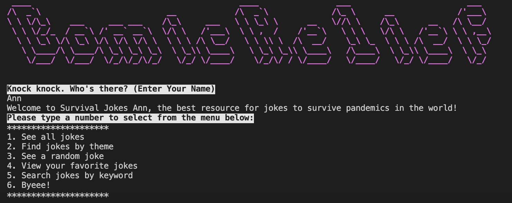

COMIC RELIEF
========================

### A CLI application to provide you a dose of humor during a pandemic. 

## How to install the application 

In your terminal, git clone the Comic Relief app from github 

    $ git clone git@github.com:deijdev/ruby-project-alt-guidelines-dc-web-030920.git

Open the app in your terminal

    $ cd ruby-project-alt-guidelines-dc-web-030920

Run "bundle install" 

    $ bundle install 

You're now ready to go!

## How to run our application. 

In your terminal, enter      

    $ ruby bin/run.rb

Enter your first name 

    $ Ann 

## How to use your application (commands that can be run)

After you enter your name, a list of menu options will be provided. 

#puts image in markdown 

Enter the corresponding number and follow the prompts. 

## What our program looks like

